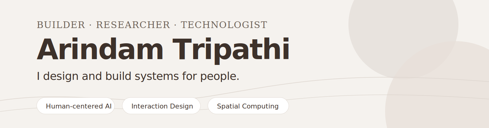

  

# Ari Tripathi

**Builder · Researcher · Technologist**

I design and build systems for people — across **AI systems, interaction design, and spatial computing**.

My work sits between engineering, design, and human behavior: ML-backed planning tools, browser utilities, research-driven product studies, XR prototypes, and interfaces that make complex workflows easier to understand and use.

Currently pursuing an **MS in Human-Computer Interaction at the University of Maryland**, with a background in **Computer Engineering from the National University of Singapore**.

[Portfolio](https://www.arindamtripathi.com) · [LinkedIn](https://www.linkedin.com/in/arindamtrip/) · [Email](mailto:aritrip@umd.edu)

---

## Current focus

- **Human-centered AI systems** — building and evaluating AI-assisted workflows, structured outputs, and decision-support tools
- **UX engineering** — translating interaction ideas into responsive, usable, production-minded interfaces
- **XR / spatial computing** — prototyping AR and VR systems around embodied interaction and environment-aware experiences
- **Research + evaluation** — using qualitative and quantitative methods to understand behavior, test ideas, and improve what gets built

---

## Selected work

<table>
  <tr>
    <td width="50%" valign="top">
      <h3>SnaPT</h3>
      

        A Chrome extension for making long ChatGPT conversations lighter, faster, and easier to navigate.
      

      

        Built around payload trimming, cached history recovery, grouped conversation turns, and a calmer control surface.
      

      

        <strong>Focus:</strong> Browser engineering, interaction design, performance, privacy-aware product decisions
      

      

        <strong>Stack:</strong> JavaScript, Chrome Extension APIs
      

    </td>
    <td width="50%" valign="top">
      <h3>Portfolio</h3>
      

        A portfolio and case-study system for presenting work across AI systems, UX research, interaction design, and XR.
      

      

        Designed as a structured proof-of-work layer rather than a static résumé page.
      

      

        <strong>Focus:</strong> Frontend architecture, content systems, visual hierarchy, responsive interaction
      

      

        <strong>Stack:</strong> Next.js, React, TypeScript, Tailwind CSS
      

    </td>
  </tr>
  <tr>
    <td width="50%" valign="top">
      <h3>Media Framing & Sentiment Pipeline</h3>
      

        A research-oriented pipeline for converting unstructured media text into structured sentiment and framing representations.
      

      

        Combines classical NLP and LLM-based approaches with attention to robustness, bias, and evaluation quality.
      

      

        <strong>Focus:</strong> NLP pipelines, LLM evaluation, bias awareness, structured outputs
      

      

        <strong>Stack:</strong> Python, NLP, LLM-based analysis
      

    </td>
    <td width="50%" valign="top">
      <h3>ShooT IT</h3>
      

        A real-time AR laser tag system combining physical hardware, multiplayer gameplay, and multisensory feedback.
      

      

        Built with Unity-based gameplay, MQTT event synchronization, and haptic feedback to improve responsiveness and game feel.
      

      

        <strong>Focus:</strong> AR systems, multiplayer sync, haptics, interaction feedback
      

      

        <strong>Stack:</strong> Unity3D, C#, MQTT, Vuforia
      

    </td>
  </tr>
  <tr>
    <td width="50%" valign="top">
      <h3>Music & Lyrics Transcription System</h3>
      

        An AI-driven system for extracting lyrical and melodic content from uploaded audio.
      

      

        Evaluated transcription reliability across audio conditions and presented outputs through a React-based interface designed for clarity.
      

      

        <strong>Focus:</strong> Audio ML, ASR, model evaluation, frontend clarity
      

      

        <strong>Stack:</strong> Python, React, SpeechBrain, Spleeter
      

    </td>
    <td width="50%" valign="top">
      <h3>TrailTales</h3>
      

        A local discovery app for surfacing non-touristy experiences through map-based browsing and recommendation-driven exploration.
      

      

        Built as an end-to-end mobile prototype with location clustering, Firebase, and Google Maps integration.
      

      

        <strong>Focus:</strong> Mobile product design, local discovery, map interaction
      

      

        <strong>Stack:</strong> Flutter, Firebase, Google Maps API, Figma
      

    </td>
  </tr>
</table>

---

## Experience signals

- Built ML-backed planning and analytics tools used by **200+ planners and business users across 10+ APAC markets**
- Contributed to a **24% improvement in promotional efficiency** through decision-support tooling
- Improved analytics adoption through iterative feature refinement, usage monitoring, and stakeholder feedback
- Built and refined production React / JavaScript interfaces for customer-facing utility workflows
- Conducted mixed-methods UX research using diary studies, contextual interviews, affinity mapping, and journey mapping
- Led and prototyped XR systems across mobile AR, VR education, multiplayer interaction, and embodied feedback

---

## Tools and methods

<table>
  <tr>
    <td width="33%" valign="top">
      <h3>Engineering</h3>
      

        React 
        Next.js 
        TypeScript 
        JavaScript 
        Python 
        SQL 
        Flutter 
        Docker
      

    </td>
    <td width="33%" valign="top">
      <h3>AI / Data</h3>
      

        pandas 
        PyTorch 
        scikit-learn 
        SpeechBrain 
        Spleeter 
        NLP 
        LLM evaluation 
        Power BI
      

    </td>
    <td width="33%" valign="top">
      <h3>Interaction / XR</h3>
      

        Unity3D 
        C# 
        Vuforia 
        MQTT 
        XR Interaction Toolkit 
        Figma 
        Usability testing 
        A/B testing
      

    </td>
  </tr>
</table>

---

## What I care about

I like building systems that are technically solid, but also legible to the people using them.

The part of building I care about most is not just whether something works. It is whether the system feels coherent, whether the interface makes the right thing easier, and whether the technical choices actually support the human workflow underneath.

---

## Elsewhere

- Portfolio: [arindamtripathi.com](https://www.arindamtripathi.com)
- LinkedIn: [linkedin.com/in/arindamtrip](https://www.linkedin.com/in/arindamtrip/)
- Email: [aritrip@umd.edu](mailto:aritrip@umd.edu)
