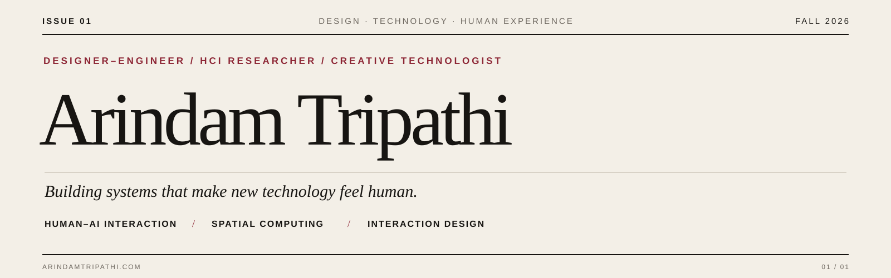

  

# Arindam Tripathi

**Designer & Engineer working across HCI, spatial computing, and human–AI interaction.**

I build systems where technical capability and human behavior meet.

I'm currently pursuing an **M.S. in Human-Computer Interaction at the University of Maryland**. Previously, I built ML-backed decision-support products at **L'Oréal Singapore** and worked on spatial iOS experiences at **LIGHT Helmets**.

[Portfolio](https://www.arindamtripathi.com) · [LinkedIn](https://www.linkedin.com/in/arindamtrip/) · [Email](mailto:aritrip@umd.edu)

---

## Selected work

### Reframed

A mixed-reality experience exploring how digital content can extend physical artworks into the surrounding space.

Rather than replacing the artwork with a virtual environment, Reframed uses the physical piece as the anchor: elements animate within the frame, move beyond its boundaries, and encourage visitors to move through and inspect the surrounding space differently.

Exhibited at **NextNOW Fest** and **Henson Mania / Henson Week 2026** at the University of Maryland.

`Unity` `C#` `Meta Quest` `Spatial Interaction`

[View on my portfolio →](https://www.arindamtripathi.com)

---

### SnaPT

A Chrome extension designed to make very long ChatGPT conversations faster and easier to navigate.

SnaPT reduces the amount of older conversation UI the browser needs to keep active at once while preserving access to the full conversation history.

`JavaScript` `Chrome Extension APIs` `Browser Performance`

[View repository →](https://github.com/arindamshivatrip/SnaPT)

---

### Aura Desk

An ambient spatial workspace concept for smart glasses, built during an **Android XR hackathon using XREAL Project Aura**.

The project explored what a desk could become when useful information no longer has to live inside a rectangular monitor: glanceable, spatially anchored widgets positioned around the user's physical workspace.

`Android XR` `XREAL Project Aura` `Spatial UI` `Ambient Computing`

[View on my portfolio →](https://www.arindamtripathi.com)

---

### Promo Optimizer

ML-backed promotional planning and decision-support tools built while working at **L'Oréal Singapore**.

The system was used by **200+ planners and business users across 10+ APAC markets** and contributed to a **24% improvement in promotional efficiency**.

My work spanned data pipelines, machine-learning workflows, analytics, interface design, product iteration, and translating complex planning logic into tools that business users could actually work with.

`Python` `SQL` `BigQuery` `Vertex AI` `Power BI`

---

### ShooT IT

A real-time augmented-reality laser-tag system combining physical hardware, multiplayer synchronization, haptic feedback, and mobile AR.

The project explored how physical action, digital state, and player feedback could remain synchronized during fast, embodied multiplayer interaction.

`Unity` `C#` `MQTT` `Vuforia` `Physical Computing`

---

## Experience

**L'Oréal Singapore**  
Data Analytics Specialist · Jul 2023 – Aug 2025

Built and shipped ML-backed planning, analytics, and decision-support tools used across 10+ APAC markets, working across engineering, data, interface design, product iteration, and stakeholder research.

 

**LIGHT Helmets**  
iOS / Spatial Computing Intern · Summer 2026

Prototyped iOS experiences around **ARKit, LiDAR-based head scanning, helmet fit, and spatial product interaction**.

 

**University of Maryland**  
M.S. Human-Computer Interaction · 2025 – 2027

Graduate work across interaction design, HCI research, human–AI systems, spatial computing, and emerging interfaces.

---

## Tools & methods

**Product & interface**  
React · Next.js · TypeScript · JavaScript · Flutter · Figma

**AI & data**  
Python · SQL · pandas · scikit-learn · PyTorch · BigQuery · Vertex AI · NLP · LLM evaluation · Power BI

**Spatial computing**  
Unity · C# · ARKit · RealityKit · Vuforia · XR Interaction Toolkit · MQTT

**Research**  
Usability testing · contextual inquiry · interviews · diary studies · affinity mapping · journey mapping · A/B testing

---

## What I'm interested in

I'm interested in technically ambitious systems that remain understandable and useful to the people interacting with them.

A lot of my work circles around a few questions:

- How should AI fit into a human workflow?
- What should spatial interfaces do that screens cannot?
- How can complex systems feel coherent rather than overwhelming?
- How do we know when a novel interaction is actually better?

I'm especially interested in work across **design engineering, human–AI interaction, spatial computing, UX engineering, and product-facing HCI**.

---

[arindamtripathi.com](https://www.arindamtripathi.com) · [LinkedIn](https://www.linkedin.com/in/arindamtrip/) · [GitHub](https://github.com/arindamshivatrip) · [Email](mailto:aritrip@umd.edu)
